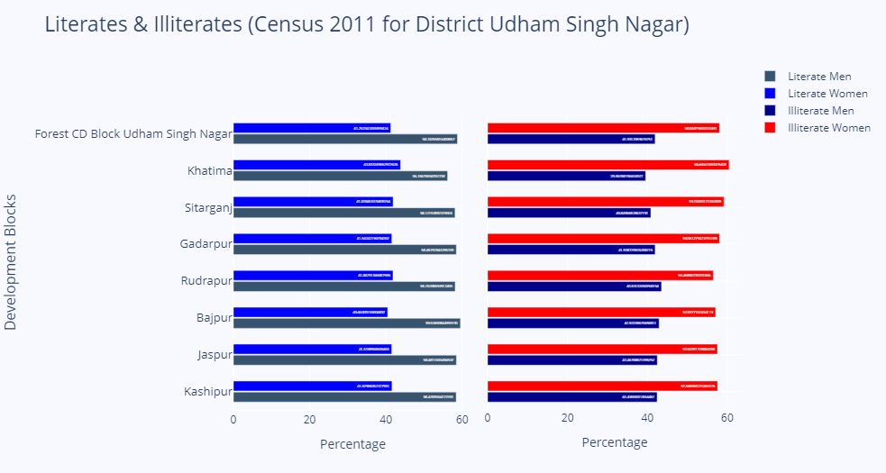

# State of Literacy among Men & Women in Uttarakhand (Census 2011)

The Supreme Court on 4th November 2022 lifted the stay imposed by the Uttarakhand High Court on a 2006 order giving 30% reservation to women having domicile of the state in state civil services. The analysis below tries to determine whether the decision was correct given the state of literacy in Uttarakhand.

(Do note that this data is provided by [Open Government Data (OGD) Platform India](https://data.gov.in/) which contains pre-cleaned excel sheets. Thus, data cleaning wasn't required here.)

---

## 1. Basics
The charts for each district showcase two horizontal bar graphs:
* First, for literate men and women.
* Second, for illiterate men and women. 

The x-axis represents the percentage while the y-axis shows the various development blocks in the district.

---

## 2. Observation -I
I found some people claiming that since a decent number of women have become educated, it is now time to scrap women's quotas. To test this, I compared the state of men & women among Literates and Illiterates as can be seen below:

We observe that among the literates, the difference between men and women isn't much. But as we dive into the realm of illiterates, we find that illiterate women are almost double in number than illiterate men.
And friends, this is how **Sample Selection Bias** fools us. People who advocate removing special provisions for women only focus on the sample of literate men & women. But once the sample changes to illiterates, the truth comes forefront.

---

## 3. Observation -II
Compare the following two graphs from Kumaon Division:

You may observe a sharp disparity between illiterate men & women in all development blocks. But when comparing the Himalayan districts (like Pithoragarh) of Uttarakhand with those that have parts of the northern plains in them (like Udham Singh Nagar), we come across a unique observation:

> "The illiterate women in Himalayan districts are twice in number than illiterate men. Districts with parts of the northern plains in them fare better comparatively."

A similar observation can be made for Garhwal Division as well:

Thus, we have a relationship but what can be the cause?! Is it the difference in ethnic culture? The result of exclusionary and unequal urbanization? Or could it be something that we’re completely missing out on!?! 
This shall be determined as we thoroughly analyze relevant data in this regard.

---

## 4. Conclusion
From data-based observations made through sections (2) and (3), it is evident that the Uttarakhand Government's and the Supreme Court's decision in favor of special provisions for women with state domicile was correct.

---

See All Charts

---